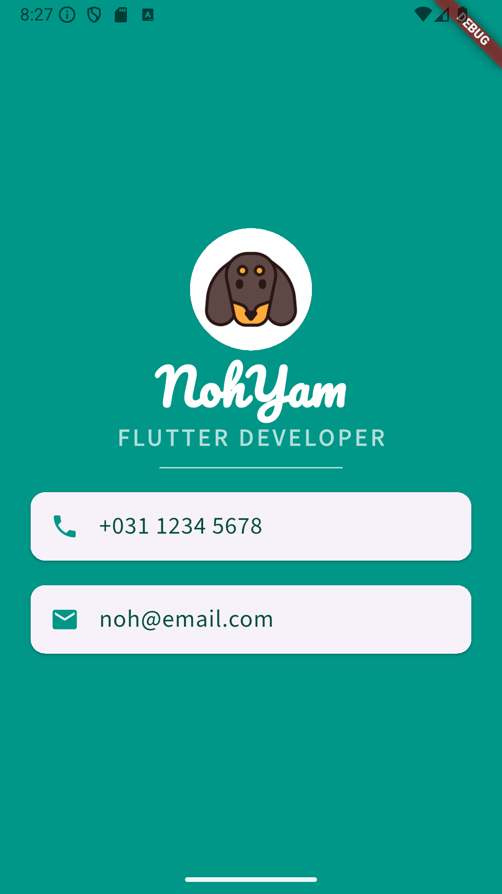

# mi_card

플러터 기초 연습으로 만든 간단한 프로필 카드 앱입니다. 
하나의 화면 안에 프로필 이미지, 이름, 직무, 연락처 카드가 들어가며 레이아웃과 위젯 구조를 익히는 데 목적이 있습니다.

## 기능 / 화면 구성
- 상단 프로필 이미지 (CircleAvatar)
- 사용자 이름 (커스텀 폰트 사용)
- 직무/직업 텍스트 (대문자 + letter spacing)
- 구분선 (Divider)
- 전화번호/이메일을 Card + ListTile 로 표현

## 사용한 주요 위젯
- `MaterialApp`, `Scaffold`
- `SafeArea`
- `Column` + `mainAxisAlignment: MainAxisAlignment.center`
- `CircleAvatar`
- `Text` + `TextStyle` (커스텀 폰트)
- `SizedBox` + `Divider`
- `Card` + `ListTile`
- `AssetImage`

## Preview

